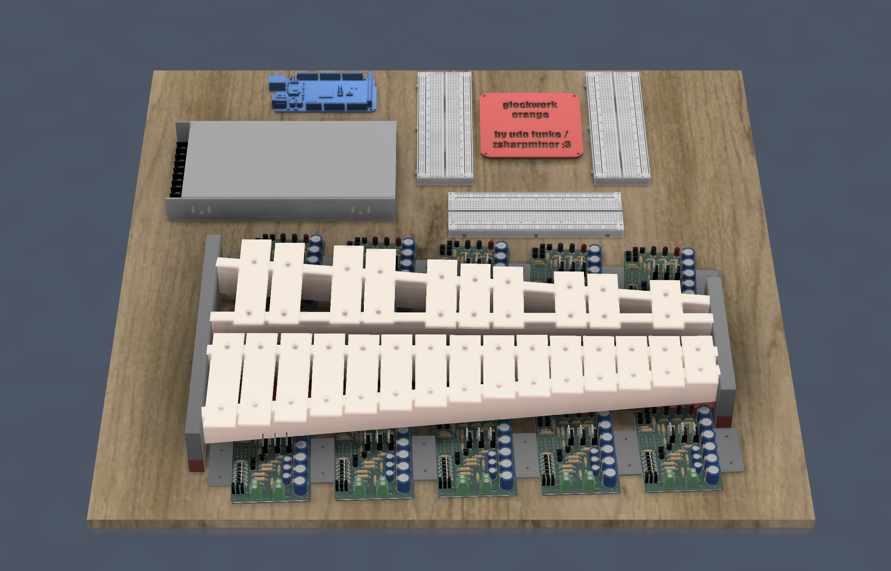
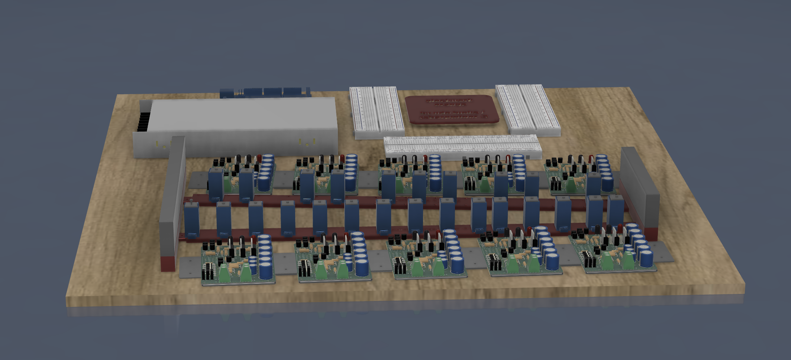
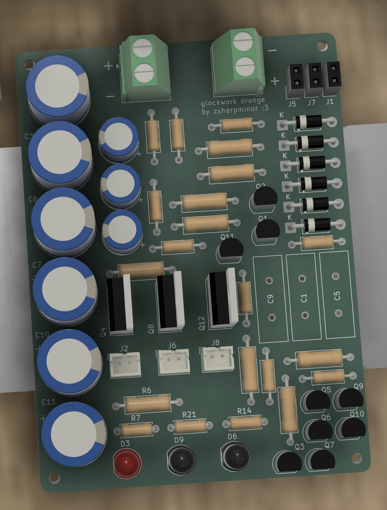
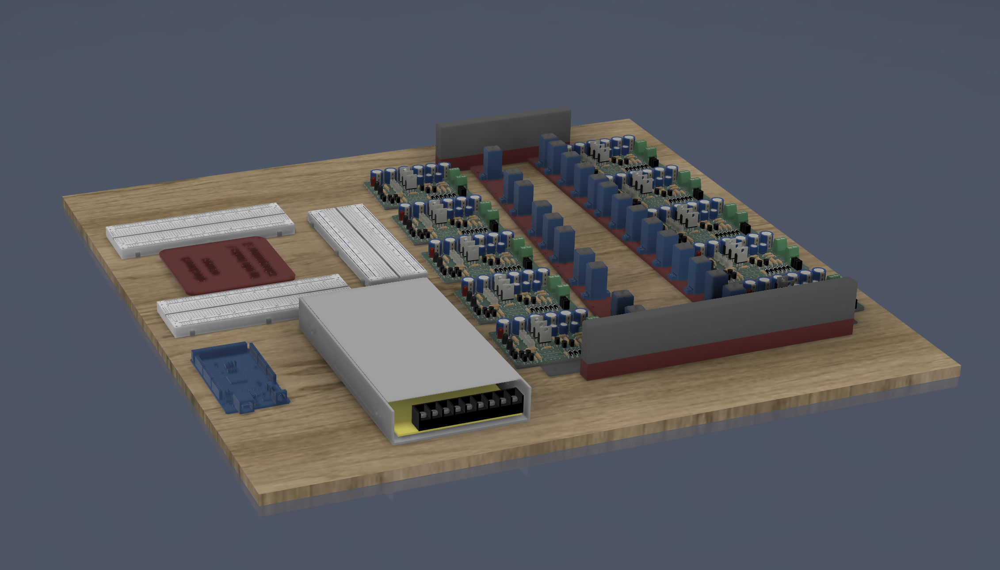
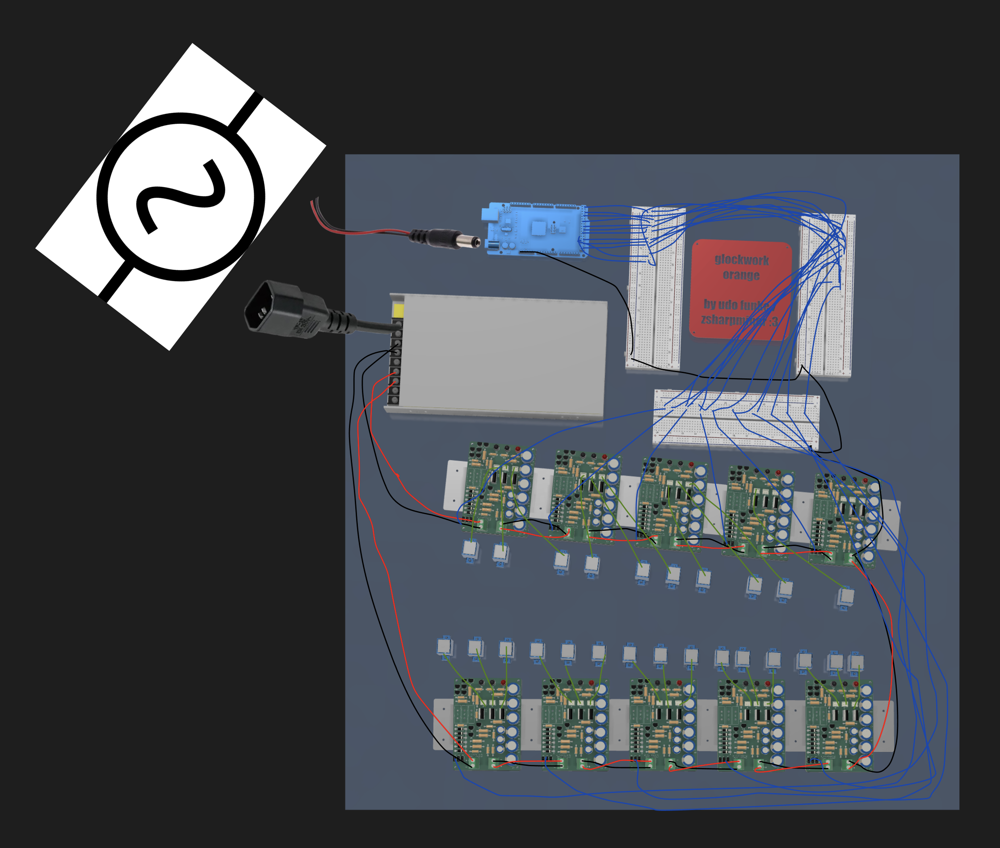

# _Glockwork Orange_, by zsharpminor

A "Clockwork Orange" is defined as a human being who has had their free will and moral agency mechanically stripped away, turning them into a predictable, unthinking mechanism controlled by outside forces like the state. The human's natural "juicy" state is manifest in the orange, whereas the clockwork represents the unnaturality and cold predictability of the system.

Anyways, enough 1984; hiya! I'm Udo, better known as @zsharpminor or gh/newtontriumphant, and I have a thing for self-playing instruments. In late 2025, I won Honorable Mention at Hack Club x AMD's _Prototype_ flagship hackathon with [FiddleStein](https://github.com/newtontriumphant/Hackclub_Prototype_Fiddlestein), a fully self-playing violin that utilized a SO-101 robot arm and a 10k-step neural network to imitate a real human arm playing violin. FiddleStein was a great concept, but it sounded _mildly bad_, to be polite. Ever since early 2026, I wanted to create another self-playing instrument that would fit in well with FiddleStein, and Glockwork Orange was the logical next step.

## About Glockwork Orange

Glockwork Orange is a fully self-playing chromatic Glockenspiel that relies on solenoids to play ANY midi file payload by adjusting the instrumentation to fit into two voices!

> Sidenote: in the musical percussion and orchestra community, "glock" is used to abbreviate "glockenspiel" and is in no way related to the firearm brand created by Gaston Glock.

Glockwork Orange was designed for [Hack Club Outpost](https://outpost.hackclub.com/) as an X-Tier project, and is [on the list of X-Tier approved projects](https://docs.google.com/document/d/1faTrnYnGDMR5YSOkvKIAk_NsVOftPFZkB7XtJXA-l8c/edit?tab=t.0) sent out by [@CAN](https://hackclub.slack.com/archives/C0B519PGU22/p1781193322652829?thread_ts=1781016229.290339&cid=C0B519PGU22).

Anyways, enough yapping. A picture plays more than a thousand notes, or however the saying goes. Feast your eyes on the final assembled mockup of Glockwork Orange below.

---

At this point, you're probably asking: **how does this lie-detector-looking-thing work?!&**

Well, it's quite simple.

1. The Arduino sends a logic signal to the PCB being striked.
2. The power supply pushes out 15V and routes it into the PCB chain.
3. The respective PCB converts that signal to the current and voltage required to operate the solenoids.
4. The MOSFET briefly powers the solenoid and, by extension, the LED.
5. The solenoid strikes the key and immediately retracts.
6. Repeat (but don't rinse. handwashing is very bad when it comes to PCBs)!

## The PCB

Glockwork Orange's PCB uses a clever arrangement of transistors, resistors, capacitors, and a MOSFET to power the white JST connectors and their respective fading red LEDs each time the individual MOSFET is triggered.

Oh? What do I hear? You're wondering how this monstrosity was wired? If you have any experience doing ground planes on PCBs, I'd recommend you avert your eyes.

I've also included an image of the PCB's schematic:

The way this schematic works is by dividing the three inputs from the Arduino into segments, which each result in one JST connector and LED being powered at one time.

## The CAD

The way this project works is that it relies on the individual components being screwed down into a plywood project panel with M2 screws. That's why there's M2 screws on EVERY SINGLE COMPONENT in my CAD folder. 

For more information, including images and in-progress screenshots of every single CAD part, refer to [JOURNAL.md](JOURNAL.md). I won't entirely leave you hanging, though. Here's a side-view:

The blue parts are the solenoid holders I designed, and they slot onto the red holder bar that I also designed. The grey parts inside the blue holders refer to the actual solenoids.

## Wiring Diagram

Please excuse ~~my dear aunt sally~~ the sloppy wiring, this is only supposed to be *representative* of the final wiring!

+15V --> Red
Shared GND --> Black
Solenoid +/- --> Green
Arduino Signal --> Blue

## Firmware

The Glockwork Orange firmware consists of two files: `glockwork_orange.ino`, which runs on the Arduino Mega 2560 and maps all 25 chromatic keys (G2–A4, MIDI 43–69) to digital pins 22–46 driving the IRLZ44N MOSFET gate lines, and `glockwork_host.py`, a Python/Tkinter desktop GUI that parses any MIDI file, re-voices it into two chromatic voices within the glockenspiel's range via octave-shifting, and streams precisely-timed strike commands over USB serial at 115200 baud. The Arduino firmware uses a non-blocking 32-slot ring buffer to schedule and execute 35ms solenoid pulses without any delay() calls, which means the timing is, dare I say so myself, quite accurate across simultaneous voices. The host communicates via a simple ASCII protocol (S to start, N{ms},{note} to schedule a strike, X to stop), making it straightforward to extend or replace the Python frontend with any serial-capable environment.

## The Why And The How

Why did I make Glockwork Orange? Well, this one's pretty simple. I always wanted to make a successor to FiddleStein, one that could permanently work and be mounted in place with actual PCBs rather than precarious wiring and hot glue. (Also, using it to get into Outpost was a pretty fun motivation!)

How did I make Glockwork Orange? The entire process is in [JOURNAL.md](JOURNAL.md). Go read it. No, seriously. A lot of research went into this project, and it's a culmination of thoughts and solenoids. TL;DR, the answer is Patience (and a lack thereof).

## Directory

.
├── Assets/ <-- Some of the most important images found in this README
├── CAD/ <-- All CAD source files, as well as a .f3z Archive
├── Firmware/ <-- Simple firmware for the Arduino
├── PCB/ <-- KiCad source files of the PCB, .STEP export of PCB
├── Production/ <-- Gerber files and zipped Gerber files
├── BOM.csv <-- All components required to build this monstrosity
├── JOURNAL.md <-- Detailed explanation and tracking of hours
└── README.md <-- This file!

## Mini BOM

**NOTE**: The full BOM is located at [BOM.csv](BOM.csv). PLEASE READ IT. THIS IS ONLY A BREAKDOWN.

**CART SCREENSHOTS** can be found in the [Assets/Cart-Screenshots](Assets/Cart-Screenshots/Digikey_Cart_Final.png) folder. PII has been redacted. If the originals are required, DM @zsharpminor on the Hack Club Slack.

| Item | Total | Link |
| :--- | ---: | :---: |
| DigiKey Components | $480.00 | [↗](BOM.csv) |
| Amazon Components | $122.00 | [↗](BOM.csv) |
| Plywood from THD | $15.00 | [↗](BOM.csv) |
| JLCPCB PCB x 10 | $15.00 | [↗](BOM.csv) |
| Arduino and PSU | **OWNED** | - |
| | **$632.00** | |

## Disclosure of AI Usage

No Artificial Intelligence was used in creating the PCB, Schematic, any of the CAD, or README / JOURNAL.

AI was solely used to automate placing links into the BOM (~10% of BOM tracked hours), and for minor assistance with the code (see bottom of [JOURNAL.md](JOURNAL.md) for additional information), and for creating a custom footprint for an obsolete capacitor.

## License

GNU General Public License (GPL)

---

Thanks for reading down all this way! If you have any questions, please reach out to me via the Hack Club Slack @zsharpminor

Made with ♡ by zsharpminor